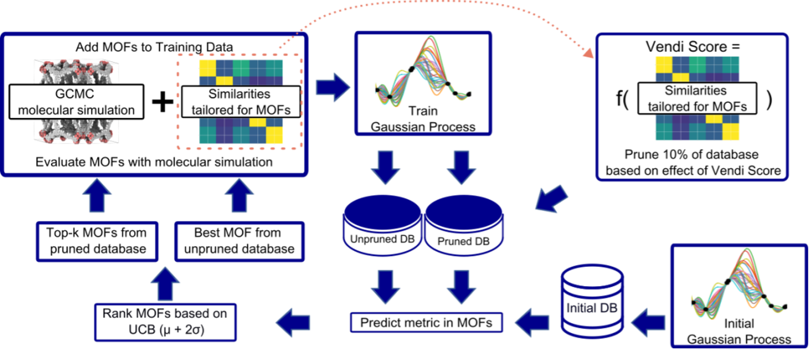

# Vendi Bayesian Optimization and application to MOF design for NH₃ adsorption

This repository contains the implementation of the Vendi Bayesian Optimization (VBO), a Bayesian optimization algorithm that seeks to find diverse solutions to a black-box optimization problem, applied to a metal-organic framework (MOF) design space to optimize for MOF properties.
We do this by designing a MOF-specific kernel that accounts for a multitude of informative MOF properties, and using the [Vendi Score](https://github.com/vertaix/Vendi-Score) to encourage the candidate MOFs to be inspected to be diverse from one another.

<p align="center">

</p>

<p align="center">
<em>The workflow of our VBO framework, where diverse MOFs are iteratively selected to optimize NH₃ adsorption capabilities.</em>
</p>

For more information, please see our paper, [Diversity-driven, efficient exploration of a MOF design space to optimize MOF properties: application to NH₃ adsorption](https://chemrxiv.org/engage/chemrxiv/article-details/661dd99b418a5379b0ee73fc).

## Installation

You can clone this repository and install the necessary dependencies using the following commands:

```bash
conda create --name vbo
conda activate vbo
conda install python==3.11.3
pip install -r requirements.txt
```

## Data

Download the data necessary to run our code at [this link](https://wustl.box.com/s/3jkz8ksu9l3d1hqikir4olainke9wc5t).
The downloaded `data` folder should be placed in the root directory of this repository, replacing the default `data` folder.

### Raw data

- The spreadsheet `DB_10042.csv` contains our entire MOF database, where each row corresponds to a specific MOF.
- The spreadsheet `Label1000.csv` contains our randomly selected 1000 MOFs that we labeled to validate our model and methods.

### Precomputed data

Various quantities can be precomputed once and loaded by our model on demand during the Bayesian optimization loop.
- The NumPy array `DB_10042_node_sims2.npy` contains the kernel matrix based on node SMILES similarities of all data points in the database (denoted as $K_\text{node}$ in our paper).
- The NumPy array `DB_10042_linker_sims2.npy` contains the kernel matrix based on linker SMILES similarities of all data points in the database (denoted as $K_\text{linker}$ in our paper).
- The NumPy array `DB_10042_distributional_sims.npy` contains the kernel matrix based on similarities of pore size distribution of all data points in the database (denoted as $K_\text{PSD}$ in our paper).
- The NumPy array `DB_10042_fixed_covariance_matrix.npy` contains the kernel matrix that combines the four individual base kernels according to Eq. (6) in our paper, where each weight $w_i = 0.25$ (see Section 3.3 of our paper).

### Trial experiments

The `simulated_runs` folder contains results from our trial experiments that make up Figure 6 of our paper.
See the next section for how to reproduce these results.

## Usage

The script `mof_search/utils.py` contains the implementation of our Gaussian process model and other helper functions, which are used in `mof_search/run_bo.py` to facilitate an optimization run.

To start an optimization run, run `mof_search/run_bo.py` with the arguments of your choice.
- The `method` argument specifies the optimization method to run, supporting `VBO` (our method), `BO` (the traditional Bayesian optimization baseline), and `random` (random search).
- The `target` argument specifies the metric to be optimized, supporting `M_Storage`, `M_DBD`, and `M_safety`; for more details on these metrics, refer to Section 2.3 of [our paper](https://chemrxiv.org/engage/chemrxiv/article-details/661dd99b418a5379b0ee73fc).

An example command is shown below:
```bash
cd mof_search
python run_bo.py --method VBO --target M_Storage --seed 0
```

You can run the three methods with seeds 0–9 to replicate our experiment results.

## Tutorial notebooks

You can further run the corresponding Jupyter notebooks in `notebooks` to follow our data-processing procedure (in subfolder `notebooks/Preprocessing`) and recreate the figures in our paper (in subfloder `notebooks/Recreate figures`).

## Citations
```bibtex
@article{liu2024diversity,
title={{Diversity-driven, efficient exploration of a MOF design space to optimize MOF properties: application to NH_3 adsorption}},
author={Liu, Tsung-Wei and Nguyen, Quan and Dieng, Adji Bousso and Gomez-Gualdron, Diego},
journal={ChemRxiv preprint},
year={2024}
}
```
